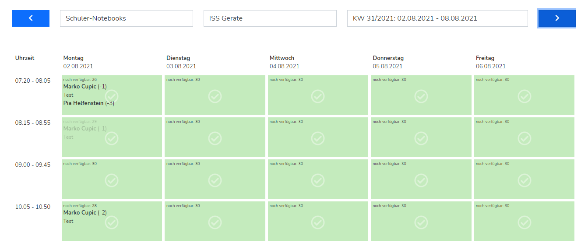
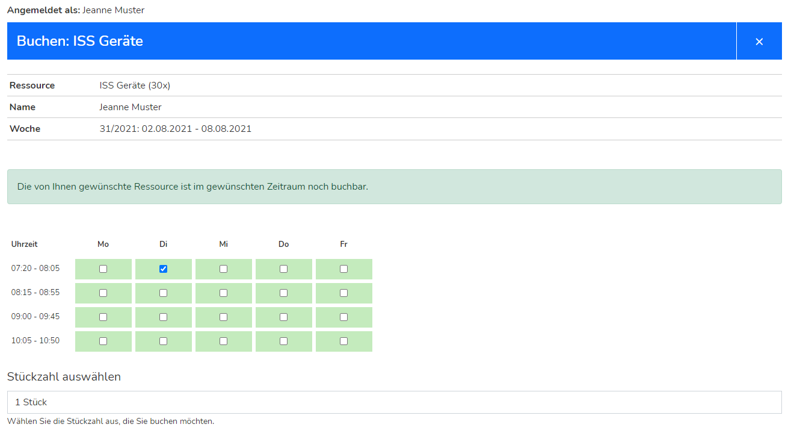
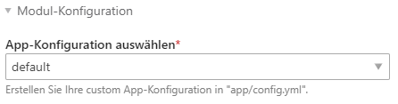
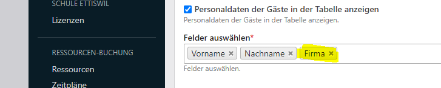

# resource-booking-bundle
Mit diesem Modul für Contao kann eine einfache Online-Ressourcenverwaltung betrieben werden.
Das Modul wurde für eine Schule entwickelt, wo ein Zimmerreservations-System benötigt wurde. Natürlich kann das Plugin auch im Zusammenhang mit anderen Ressourcen betrieben werden.

Ab Version 3.x kann eingestellt werden, wie viele Items einer Ressource buchbar sein können. Damit wird es möglich eine Ressource von mehreren Personen buchen zu lassen, bis diese ausgebucht ist. Ein typischer use case können buchbare Geräte/Computer sein.

## Rückwärtskompatibilität
**!Achtung beim Update von Version 2.x auf 3.x ist es zu grossen Änderungen an den Templates gekommen. Unter anderem wurden die Templates für eine bessere Übersichtlichkeit gesplitet. Vorher angepasste Custom-Templates müssen neu geschrieben werden.**

## Take a look


[Downlaod als mp4](https://github.com/markocupic/markocupic/blob/main/resource-booking-bundle/resource-booking-bundle.mp4?raw=true)


### Buchungstabelle mit Wochenübersicht:




### Buchungsfenster:




## Konfiguration
Nach der Installation mit dem Contao Manager müssen:
* Mindestens 1 Reservations-Zeitfenster-Typ erstellt werden.
* Danach darin die Reservations-Zeitfenster im Zeitformat H:i (08:00 bis 08:45) erstellt werden.
* Ressourcen-Typen erstellt werden.
* In jedem Ressourcen-Typ mindestens eine Ressource (z.B. Zimmer) erstellt werden.
* Mindestens 1 Mitglied (Frontend-Benutzer) angelegt werden. (Das Buchungsmodul wird nur bei eingeloggtem Benutzer angezeigt.)




Die Erweiterung wird mit einer Standardkonfiguration ausgeliefert. Weitere Konfigurationssets können erstellt werden. Mehr dazu weiter [unten](#app-konfiguration-anpassen).

Das Tool setzt auf [vue.js](https://vuejs.org/), [Fontawesome](https://fontawesome.com/) und [Bootstrap](https://getbootstrap.com/) auf. Die benötigten Libraries/Frameworks werden automatisch mitinstalliert und im Template eingebunden.

Anm: Bei der Installation wird neben den oben erwähnten Erweiterungen auch [codefog/contao-haste](https://github.com/codefog/contao-haste) mitinstalliert.

## Benachrichtigung
Die Benachrichtigung via [Contao Notification Center](https://github.com/terminal42/contao-notification_center) bei Buchung/Stornierung ist ein kostenpflichtiges Zusatzfeature. Bitte nehmen Sie per E-Mail mit dem Autor der Erweiterung [Kontakt](https://github.com/markocupic/resource-booking-bundle/blob/0080449a1a3fde63b1b9ad0b2fd0fd153ba82b4c/composer.json#L16) auf.

## Template mit zusätzlichen Mitgliederdaten erweitern
Sollen zusätzliche Mitgliederdaten in der Buchungsübersicht angezeigt weden, müssen zwei Dinge angepasst werden.

Erstens muss in der Moduleinstellung das Feld, welches zusätzlich angezeigt werden soll, ausgewählt werden.



Weiter muss zusätzlich das Template angepasst werden. Mit *{{ booking.bookedByCompany }}* kann der Firmenname oder mit *{{ booking.bookedByCity }}* der Wohnort mitangezeigt werden. Achtung! Hierbei handelt es sich nicht um einen Contao Inserttag, sondern um die "vue.js-Mustache-Syntax-Schreibweise". Das Leerzeichen nach bzw. vor der geschweiften Klammer ist nötig.


## Events
Der ***rbb.event.pre_booking*** Event wird unmittelbar vor dem Datenbank-Insert ausgelöst. Mit einer Event-Subscriber-Klasse lassen sich beispielsweise die Datenbankeinträge manipulieren.

Der ***rbb.event.post_booking*** Event wird nach dem Buchungs-Request ausgelöst. Mit einer Event-Subscriber-Klasse, die auf den Event hört, können unmittelbar nach der Buchung Aktionen durchgeführt werden. Beispielsweise kann eine Benachrichtigung gesendet werden oder es können weitere Einträge in der Datenbank getätigt werden.

Der ***rbb.event.pre_canceling*** Event wird unmittelbar vor dem Stornieren einer Buchung ausgelöst.

Der ***rbb.event.post_canceling*** Event wird unmittelbar nach dem Stornieren einer Buchung ausgelöst.

## Event Subscriber
Mit event subscribern kann die Applikation an mehreren Stellen erweitert werden. Dazu muss eine Subscriber Klasse erstellt werden und diese registriert werden.

```
# Registrierung anhand des rbb.event.post_booking Events in listener.yml
services:
  App\EventSubscriber\PostBookingEventSubscriber:
    tags:
    - { name: kernel.event_subscriber }
```

Weiter muss eine entsprechende Event-Subscriber-Klasse erstellt werden (hier anhand rbb.event.post_booking):

```php
<?php

declare(strict_types=1);

namespace App\EventSubscriber;

use Contao\Date;
use Markocupic\ResourceBookingBundle\Event\PostBookingEvent;
use Symfony\Component\EventDispatcher\EventSubscriberInterface;

final class PostBookingEventSubscriber implements EventSubscriberInterface
{
   const priority = 10000;

   public static function getSubscribedEvents(): array
    {
        return [
            PostBookingEvent::NAME => ['onPostBooking', self::PRIORITY],
        ];
    }

    public function onPostBooking(PostBookingEvent $objPostBookingEvent): void
    {
        // For demo usage only
        $objBookingCollection = $objPostBookingEvent->getBookingCollection();
        $objUser = $objPostBookingEvent->getUser();

        while ($objBookingCollection->next()) {
            if (null !== $objUser) {
                // Send notifications, manipulate database
                // or do some other insane stuff
                $strMessage = sprintf(
                    'Dear %s %s'."\n".'You have successfully booked %s on %s from %s to %s.',
                    $objUser->firstname,
                    $objUser->lastname,
                    $objBookingCollection->getRelated('pid')->title,
                    Date::parse('d.m.Y', $objBookingCollection->startTime),
                    Date::parse('H:i', $objBookingCollection->startTime),
                    Date::parse('H:i', $objBookingCollection->endTime)
                );
                mail(
                    $objUser->email,
                    utf8_decode((string) $objBookingCollection->title),
                    utf8_decode((string) $strMessage)
                );
            }
        }
    }
}

```

### XmlHttp event subscriber
Das Buchungstool basiert fast vollständig auf Ajax Requests. Mit einer eigenen Event Subscriber Klasse können die Responses auf diese Ajax Anfragen angepasst werden oder es lassen sich auch custom Anfragen implementieren.
Der *rbb.event.xml_http_request* Event wird bei Ajax-Anfragen vor dem Absenden der Response zurück an den Browser getriggert.

Dazu muss die Subscriber-Klasse, die auf den *rbb.event.xml_http_request* Event hört, in der listener.yml registriert werden:

```
services:
  App\EventSubscriber\AjaxRequestEventSubscriber:
    arguments:
    '@request_stack'
    tags:
    - { name: kernel.event_subscriber }

```

Weiter muss eine entsprechende Event-Subscriber-Klasse erstellt werden.
Mit der Konstante "priority" kann die Reihenfolge eingestellt werden. Je grösser der Wert, umso eher wird der Subscriber aufgerufen. Der Originalsubscriber hat als Priorität den Wert 1000 zugewiesen.

```php
<?php

declare(strict_types=1);

namespace App\EventSubscriber;

use Markocupic\ResourceBookingBundle\Event\AjaxRequestEvent;
use Symfony\Component\EventDispatcher\EventSubscriberInterface;
use Symfony\Component\HttpFoundation\RequestStack;

final class AjaxRequestEventSubscriber implements EventSubscriberInterface
{
    const priority = 1010;

    public function __construct(private readonly RequestStack $requestStack)
    {
    }

    public static function getSubscribedEvents(): array
    {
        return [
            AjaxRequestEvent::NAME => ['onXmlHttpRequest', self::PRIORITY],
        ];
    }

    public function onXmlHttpRequest(AjaxRequestEvent $ajaxRequestEvent): void
    {
        $request = $this->requestStack->getCurrentRequest();

        if ($request->isXmlHttpRequest()) {
            $action = $request->request->get('action', null);

            if (null !== $action) {
                if (\is_callable([self::class, 'on'.ucfirst($action)])) {
                    $this->{'on'.ucfirst($action)}($ajaxRequestEvent);
                }
            }
        }
    }

    /**
     * @throws \Exception
     */
    protected function onFetchDataRequest(AjaxRequestEvent $ajaxRequestEvent): void
    {
        // Stop propagation and do not run original event handler
        // Works only if the priority is > 10
        $ajaxRequestEvent->stopPropagation();

        // Get response object
        $ajaxResponse = $ajaxRequestEvent->getAjaxResponse();

        // Add some custom data to the response object
        $ajaxResponse->setData('foo', 'bar');
        $ajaxResponse->setStatus(AjaxResponse::STATUS_SUCCESS);
    }

    protected function onMyCustomRequest(AjaxRequestEvent $ajaxRequestEvent): void
    {
        // Respond to custom ajax requests
    }

    protected function onApplyFilterRequest(AjaxRequestEvent $ajaxRequestEvent): void
    {
        // Do some stuff here
    }

    protected function onJumpWeekRequest(AjaxRequestEvent $ajaxRequestEvent): void
    {
        // Do some stuff here
    }

    protected function onBookingRequest(AjaxRequestEvent $ajaxRequestEvent): void
    {
        // Do some stuff here
    }

    protected function onBookingFormValidationRequest(AjaxRequestEvent $ajaxRequestEvent): void
    {
        // Do some stuff here
    }

    protected function onCancelBookingRequest(AjaxRequestEvent $ajaxRequestEvent): void
    {
        // Do some stuff here
    }
}
```


## App Konfiguration anpassen
Die Erweiterung wird mit einer Default-Konfiguration installiert.
In config/config.yml können weitere Konfigurations-Sets erstellt werden,
welche dann in den Frontend-Moduleinstellungen ausgewählt werden können.

Dazu muss in config/config.yml ein Eintrag erstellt werden.
```
# config/config.yml

markocupic_resource_booking:
    apps:
        my_rbb_custom:
            beginnWeek: 'monday'
            intBackWeeks: -10
            intAheadWeeks: 60
```


